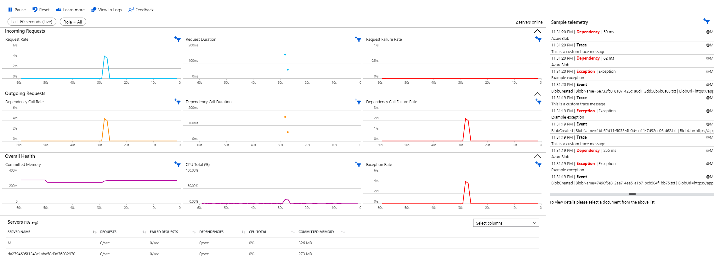
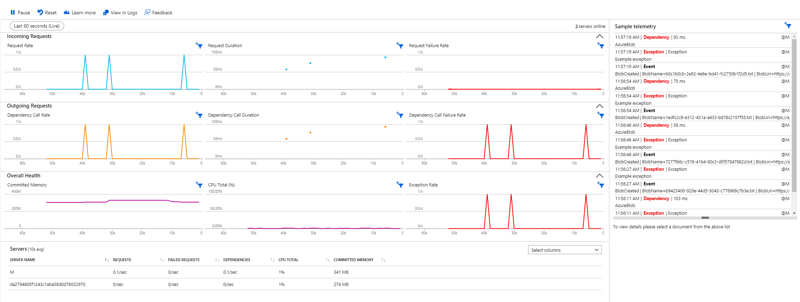

# Installation of Application Insights on Azure for .NET Core Web Application

This repository contains the necessary tools and scripts to deploy a .NET Core web application integrated with Application Insights on Azure. This guide will walk you through creating a new .NET Core web application, setting up Azure resources via a script, and deploying the application with monitoring enabled.

## Prerequisites

Before you begin, ensure you have the following installed:
- [.NET Core SDK](https://dotnet.microsoft.com/download)
- [Azure CLI](https://docs.microsoft.com/en-us/cli/azure/install-azure-cli)
- An active Azure subscription.

## Step 0: Create a .NET Core Web Application

Start by creating a new .NET Core web application on your local machine. Open your terminal and run the following command:

```bash
dotnet new webapp -n SimpleWebApp
```

This command creates a new folder named SimpleWebApp containing a simple web application.

## Step 1: Run the Setup Script

check the setup variables in the ```0-config.sh``` script and ```chmod +x 0-config.sh```.
```bash
# Configuration variables for the Azure setup
export RESOURCE_GROUP="application-insights-demo-sis"
export TAGS='--tags autokillDays=7 reason=testing'
export REGIONS="westeurope"
export APP_NAME="app-insights-demo-sis"
export APP_SERVICE_PLAN="app-insights-demo-sis-plan"
export APP_INSIGHTS_NAME="app-insights-demo-sis-insights"
export FUNCTION_APP_NAME="app-insights-demo-sis-func"
export STORAGE_ACCOUNT_NAME="appinsightstoragesis"
export LOCAL_REPO_PATH="SimpleWebApp/"
export FUNCTION_APP_PATH="MyFunctionApp/"
```
This script automates the creation of Azure resources necessary for your application, including the deployment of SimpleWebApp web application to Azure.

```bash
chmod +x 1-InitialSetup.sh
./1-InitialSetup.sh
```

Important:
During the execution of the script, you will be prompted to input a username and password. This is necessary for pushing your application to Azure. 
Find the Git Clone Uri, local username, and password from Deployment Center on Web App reouce on Azure. Navigate to local SimpleWebApp repository and configure Git deployment
```bash
git init
git add .
git commit -m "Initial commit"
git remote remove azure 2> /dev/null  # Remove if exists to prevent errors
git config --global --unset credential.helper 2> /dev/null  # Unset to prevent errors
git config --global credential.helper 'cache --timeout=36000'

git remote add azure <DEPLOYMENT_URL>
git push azure master
```
## Step 2: Setup Application Insights
```bash
chmod +x 2-AppInsights-setup.sh
./2-AppInsights-setup.sh
```
This command creates an Application Insights resource with the type and kind set to 'web', which is suitable for monitoring web applications.

## Step 3: Setting Up Application Insights

To monitor and track the performance of your application, we will integrate Microsoft Application Insights. Follow these steps to configure Application Insights:

Fetch the connection string from Azure:

```
source ./0-config.sh
az monitor app-insights component show --app $APP_INSIGHTS_NAME --resource-group $RESOURCE_GROUP --query connectionString -o tsv
```

1. **Add the Application Insights Package:**

   Navigate to your SimpleWebApp directory. Run the following command to add the Microsoft Application Insights package to your project:

   ```bash
   dotnet add package Microsoft.ApplicationInsights.AspNetCore
   ```
2. **Configure Application Insights in appsettings.json:**
    Add the following JSON configuration to your ```appsettings.json``` file. This configuration includes the connection string with your unique InstrumentationKey, IngestionEndpoint, LiveEndpoint, and ApplicationId. Make sure to replace the placeholders with your actual Application Insights values, Note that we are going to use App_Insights instead of ApplicationInsight to prevent any conflicts with other services that use Application Insights and send telemetry automatically.
    ```json
    {
    "Logging": {
        "LogLevel": {
        "Default": "Information",
        "Microsoft.AspNetCore": "Warning"
        }
    },
    "App_Insights": {
        "ConnectionString": "INSERT_CONNECTION_STRING_HERE"
    },
    "AllowedHosts": "*"
    }
    ```
    Add the Application Insight service to the ```Program.cs```:

    ```csharp
    // Updated Application Insights configuration
    builder.Services.AddApplicationInsightsTelemetry(options =>
    {
        options.ConnectionString = builder.Configuration["App_Insights:ConnectionString"];
    });
    ```

## Step 4: Create a Function App as Backend service and internal API for the background jobs

This script automates the creation of Azure resources necessary for your Function App, including the deployment of Storage Account and Function App to Azure.

```bash
chmod +x 4-FunctionApp.sh
./4-FunctionApp.sh
```

To create a Function App for handling background jobs and internal API tasks, ensure you have the Azure Functions Core Tools installed. Follow these steps to set up and deploy your Function App:

### Install Azure Functions Core Tools:
Here's the modified sentence with a Markdown link:

If you haven't already installed Azure Functions Core Tools, you can do so by following the installation guide [here](https://learn.microsoft.com/en-us/azure/azure-functions/functions-run-local?tabs=linux%2Cisolated-process%2Cnode-v4%2Cpython-v2%2Chttp-trigger%2Ccontainer-apps&pivots=programming-language-csharp).
### Create and Configure the Function App:
Use the Azure CLI to create a new Function App and its related resources. Navigate to your working directory and execute the following commands:

```bash
func init MyFunctionApp --worker-runtime dotnet
cd MyFunctionApp
func new --name MyHttpFunction --template "HTTPTrigger"
dotnet add package Newtonsoft.Json
```

This sets up a new Azure Function App with a single HTTP-triggered function. The --authlevel "anonymous" parameter allows the function to be triggered without authentication, which is suitable for internal use.

### Files to Modify
- `MyHttpFunction.cs`: This file contains the main Azure Function code that processes HTTP requests and interacts with Azure Blob Storage.
- `local.settings.json`: This file holds all your local configuration settings, including connection strings and application settings.

    ### 1. Update `MyHttpFunction.cs`
    Replace the existing code in `MyHttpFunction.cs` with the new code below that defines an HTTP-triggered function capable of receiving requests, processing names, and storing messages in Azure Blob Storage:

    ```cs
    using System;
    using System.IO;
    using System.Threading.Tasks;
    using Microsoft.AspNetCore.Http;
    using Microsoft.AspNetCore.Mvc;
    using Microsoft.Azure.WebJobs;
    using Microsoft.Azure.WebJobs.Extensions.Http;
    using Microsoft.Extensions.Logging;
    using Microsoft.WindowsAzure.Storage;
    using Microsoft.WindowsAzure.Storage.Blob;
    using Newtonsoft.Json;

    public static class HttpTrigger1
    {
        [FunctionName("HttpTrigger1")]
        public static async Task<IActionResult> Run(
            [HttpTrigger(AuthorizationLevel.Function, "get", "post", Route = null)] HttpRequest req,
            ILogger log)
        {
            log.LogInformation("C# HTTP trigger function processed a request.");

            string connectionString = Environment.GetEnvironmentVariable("AzureWebJobsStorage");
            CloudStorageAccount storageAccount = CloudStorageAccount.Parse(connectionString);
            CloudBlobClient blobClient = storageAccount.CreateCloudBlobClient();
            CloudBlobContainer container = blobClient.GetContainerReference("azure-webjobs-container");
            await container.CreateIfNotExistsAsync();

            string name = req.Query["name"];
            string requestBody = await new StreamReader(req.Body).ReadToEndAsync();
            dynamic data = JsonConvert.DeserializeObject(requestBody);
            name = name ?? data?.name;

            string responseMessage = string.IsNullOrEmpty(name)
                ? "This HTTP triggered function executed successfully. Pass a name in the query string or in the request body for a personalized response."
                : $"Hello, {name}. This HTTP triggered function executed successfully.";

            CloudBlockBlob blockBlob = container.GetBlockBlobReference($"{Guid.NewGuid()}.txt");
            await blockBlob.UploadTextAsync(responseMessage);

            return new OkObjectResult(responseMessage);
        }
    }

    ```

    ### 2. Update `local.settings.json`
    Enter the Azure Storage account connection string in local.settings.json, which you can find in your Azure Storage account keys:

    ```json
    {
        "IsEncrypted": false,
        "Values": {
            "AzureWebJobsStorage": "INSERT_CONNECTION_STRING_HERE",
            "FUNCTIONS_WORKER_RUNTIME": "dotnet"
        }
    }
    ```

### Deploy the Function App:
```bash
source ./0-config.sh
cd $FUNCTION_APP_PATH
func azure functionapp publish $FUNCTION_APP_NAME
```

## Step 5: Add more functionality to the webapp
 
### Files to Modify
- `Index.cshtml`: Razor view file for the home page.
- `Index.cshtml.cs`: C# code-behind file for the home page.

    ### 1. Update `Index.cshtml`
    Replace the existing code in `Index.cshtml` with the following to add a new form and display API responses:

    ```html
    @page
    @model SimpleWebApp.Pages.IndexModel
    @{
        ViewData["Title"] = "Home page";
    }

    <!DOCTYPE html>
    <html lang="en">
    <head>
        <meta charset="UTF-8">
        <meta name="viewport" content="width=device-width, initial-scale=1.0">
        <title>@ViewData["Title"]</title>
        <link rel="stylesheet" href="https://stackpath.bootstrapcdn.com/bootstrap/4.3.1/css/bootstrap.min.css">
        <style>
            body { padding: 20px; }
            .header { margin-bottom: 40px; }
            .alert { margin-top: 20px; }
        </style>
    </head>
    <body>
        <div class="container">
            <div class="text-center header">
                <h1 class="display-4">Welcome</h1>
                <p>Learn about <a href="https://learn.microsoft.com/aspnet/core">building Web apps with ASP.NET Core</a>.</p>
            </div>

            <form method="post" class="form-inline justify-content-center">
                <button type="submit" asp-page-handler="FetchData" class="btn btn-primary mr-2">Fetch Data</button>
                
                <div class="form-group">
                    <label for="name" class="mr-2">Name:</label>
                    <input type="text" id="name" name="name" class="form-control mr-2" placeholder="Enter your name">
                    <button type="submit" asp-page-handler="FetchDataWithName" class="btn btn-success">Fetch Data with Name</button>
                </div>
            </form>
            
            @if (Model.ApiResponse != null)
            {
                <div class="alert alert-info">
                    API Response: @Model.ApiResponse
                </div>
            }

            @if (Model.CustomApiResponse != null)
            {
                <div class="alert alert-success">
                    Custom API Response: @Model.CustomApiResponse
                </div>
            }
        </div>
    </body>
    </html>
    ```

    ### 2. Update `Index.cshtml.cs`
    make sure to provide the invokation API for the customApiUrl.
    ```cs
    using Microsoft.AspNetCore.Mvc;
    using Microsoft.AspNetCore.Mvc.RazorPages;
    using System;
    using System.Net.Http;
    using System.Threading.Tasks;
    using System.Web;

    namespace SimpleWebApp.Pages;

    public class IndexModel : PageModel
    {
        private readonly ILogger<IndexModel> _logger;

        [BindProperty]
        public string Name { get; set; }

        public string ApiResponse { get; set; }
        public string CustomApiResponse { get; set; }

        public IndexModel(ILogger<IndexModel> logger)
        {
            _logger = logger;
        }

        public void OnGet()
        {
        }

        public async Task<IActionResult> OnPostFetchDataAsync()
        {
            using (var client = new HttpClient())
            {
                try
                {
                    Random random = new Random();
                    int randomId = random.Next(1, 201);
                    string apiUrl = $"https://jsonplaceholder.typicode.com/todos/{randomId}";
                    ApiResponse = await client.GetStringAsync(apiUrl);
                }
                catch (Exception ex)
                {
                    _logger.LogError(ex, "API call failed.");
                    ApiResponse = "API call failed.";
                }
            }
            return Page();
        }

        public async Task<IActionResult> OnPostFetchDataWithNameAsync()
        {
            using (var client = new HttpClient())
            {
                try
                {
                    var encodedName = HttpUtility.UrlEncode(Name);
                    string customApiUrl = $"INVOKATION_API&name={encodedName}";
                    CustomApiResponse = await client.GetStringAsync(customApiUrl);
                }
                catch (Exception ex)
                {
                    _logger.LogError(ex, "Custom API call failed.");
                    CustomApiResponse = "Custom API call failed.";
                }
            }
            return Page();
        }
    }

    ```
    
    ### 3. Push to deploy
    ```bash
    cd $LOCAL_REPO_PATH
    git add .
    git commit -m "add more functionality to web app"
    git push azure master
    ```

So far, we have created a simple web app with functionality to call a public API and utilize a function app as a backend service. If deployed correctly, you should be able to see the same map as the following image. We can quickly notice that there is no sign of blob storage logs in the map. The reason is that we intentionally used `--disable-app-insights` while creating the function app in `4-functionapp.sh`.

Let's set up Application Insights to send telemetry and capture the dependencies on the application map.

<div align="center">
  
</div>

## Step 6: Managing Application Insights for Function App via the Console

1. Enter the console.
2. Find your Function App.
3. In the settings on the right, choose Application Insights.
4. Enable Application Insights and designate the previously established Application Insight resource by clicking "Select existing resource."

Upon completion, you'll notice the Blob Storage dependency displayed on the application map.

<div align="center">
  
</div>

### Remove Application Insight from Console
Off-the-shelf Application Insights can send and digest a high volume of information, potentially causing unnecessary costs for monitoring. Although it is a simple method for deploying telemetry collection from your app, it lacks flexibility. To have more control over the telemetry behavior of the app, we need to manually define the Application Insights connection and telemetry configuration.

#### IMPORTANT
It is important not to use `APPLICATIONINSIGHTS_CONNECTION_STRING` as the name of the environment variable since the function app automatically enables the Application Insights agent and collects data again. Therefore, whether you are defining the connection string locally in `local.settings.json` or in the environment variables of your function app, you should use another name, such as `APP_INSIGHTS_CONNECTION_STRING`. With this name, the Application Insights agent will not be automatically enabled. Another important point is that, in addition to `Microsoft.ApplicationInsights.AspNetCore`, the `Microsoft.NET.Sdk.Functions` package inherently searches for the `APPLICATIONINSIGHTS_CONNECTION_STRING` variable and, if present in local or cloud environments, will override the settings and send all the logs to Application Insights. Thus, by using a different name than `APPLICATIONINSIGHTS_CONNECTION_STRING`, we both prevent the agent from being automatically enabled and the `Microsoft.NET.Sdk.Functions` package from sending telemetry.

Let's remove Application Insights from the Function App and achieve the same goal through code instead of a non-code agent implementation. To remove Application Insights from the Function App, access the Environment Variables section and delete the Application Insight variables. This action restores the Function App's Application Insight section to its original state. It automatically reactivates once the variables are removed. You need to remove the following variables:
1. APPINSIGHTS_INSTRUMENTATIONKEY
2. APPLICATIONINSIGHTS_CONNECTION_STRING

## Step 7: Integrate Application Insights SDK into Your Function App

To include the Application Insights SDK into your Function App, start by adding the necessary package from the project directory. Run the following command:

```bash
dotnet add package Microsoft.ApplicationInsights.AspNetCore --version 2.22.0
```

Next, verify that your host.json file includes the appropriate settings to enable Application Insights:

```json
{
    "version": "2.0",
    "logging": {
        "applicationInsights": {
            "samplingSettings": {
                "isEnabled": true
            },
            "enableLiveMetricsFilters": true
        }
    }
}
```

Ensure that the `APP_INSIGHTS_CONNECTION_STRING` is defined in the environment variables in the Function App settings or `local.settings.json`.

### Sending Custom Event in Function App

To enable custom events in your Function App, you need to include specific packages that allow interaction with Application Insights. Add the following `using` statements at the top of `MyHttpFunction.cs` file:

```csharp
using Microsoft.ApplicationInsights;
using Microsoft.ApplicationInsights.Extensibility;
using System.Collections.Generic; // Required for using Dictionary
```

#### Initialization of TelemetryClient
Add the following code to initialize the TelemetryClient. This client will be used to send telemetry data to Application Insights.

```csharp
private static TelemetryClient telemetryClient;
static HttpTrigger1()
{
    // Retrieve the Application Insights connection string from environment variables
    string connectionString = Environment.GetEnvironmentVariable("APP_INSIGHTS_CONNECTION_STRING");

    // Create a default telemetry configuration
    TelemetryConfiguration configuration = TelemetryConfiguration.CreateDefault();

    // Assign the retrieved connection string to the configuration
    configuration.ConnectionString = connectionString;

    // Initialize the telemetry client with the configured settings
    telemetryClient = new TelemetryClient(configuration);
}
```

This block of code performs the following functions:

- Environment Variable Retrieval: It retrieves the Application Insights connection string from the environment variables. This connection string is critical for connecting your application to the correct Application Insights resource.
- Configuration Setup: It creates a default telemetry configuration and assigns the retrieved connection string to it.
- TelemetryClient Initialization: It initializes the TelemetryClient with the specified configuration. This client is responsible for sending telemetry data from your application to Application Insights.

To track a custom event for blob creation, use the following line of code:

```csharp
// Create a dictionary to hold custom properties
Dictionary<string, string> customProperties = new Dictionary<string, string>();
customProperties.Add("BlobName", blockBlob.Name);
customProperties.Add("BlobUri", blockBlob.Uri.ToString());

// Track a custom event with the custom properties
telemetryClient.TrackEvent("BlobCreated", customProperties);
```

This block of code performs the following functions:


- A new dictionary named `customProperties` of type `<string, string>` is created. This dictionary is designed to hold key-value pairs where both the key and value are strings. This structure is used to store metadata about the event that you wish to log.


- Two properties are added to the `customProperties` dictionary:
    - `"BlobName"`: The name of the blob. `blockBlob.Name` retrieves the name property of the blob, which uniquely identifies it within its storage container.
    - `"BlobUri"`: The URI of the blob. `blockBlob.Uri.ToString()` converts the URI object of the blob to its string representation, providing a web address where the blob can be accessed.


- The `telemetryClient.TrackEvent` method is called to log a custom event named `"BlobCreated"`. This event is sent to Application Insights with the `customProperties` dictionary attached. Application Insights uses this information to record and display an event indicating that a blob was created, along with the associated metadata (blob name and URI).

## Output

Here is the result of adding a custom event using the Application Insights SDK. Noticeably, there are no live metrics (charts and sample telemetry) available for this setup. This is because we are manually configuring the telemetry setup and not using the agent-based method. However, the log is appearing in the transaction search and contains the custom information that we defined `"BlobName"` and `"BlobUri"`.


<div align="center">
  
  
  
</div>


## Enhancing Azure Function with Advanced Telemetry

To enhance our Azure Function with advanced telemetry features including real-time metrics and detailed request tracking, follow these steps:

1. QuickPulseTelemetryProcessor Setup

Add the following code in the static constructor of the `HttpTrigger1` class to initialize `QuickPulseTelemetryProcessor`:

```csharp
using Microsoft.AspNetCore.Http.Extensions;
using Microsoft.ApplicationInsights.DataContracts;
using Microsoft.ApplicationInsights.Extensibility.PerfCounterCollector.QuickPulse;
```

```csharp
QuickPulseTelemetryProcessor quickPulseProcessor = null;
configuration.DefaultTelemetrySink.TelemetryProcessorChainBuilder
    .Use((next) => {
        quickPulseProcessor = new QuickPulseTelemetryProcessor(next);
        return quickPulseProcessor;
    })
    .Build();

var quickPulseModule = new QuickPulseTelemetryModule();
quickPulseModule.Initialize(configuration);
quickPulseModule.RegisterTelemetryProcessor(quickPulseProcessor);
```

2. Manual Request Tracking
Incorporate manual request tracking by adding this code to the Run method:

```csharp
var timer = System.Diagnostics.Stopwatch.StartNew();
var startTime = DateTime.UtcNow;
```

```csharp
timer.Stop();
var telemetry = new RequestTelemetry
{
    Name = $"{req.Method} {req.Path}",
    Timestamp = startTime,
    Duration = timer.Elapsed,
    ResponseCode = "200", // Adjust based on actual response
    Success = true,
    Url = new Uri(req.GetDisplayUrl())
};
telemetryClient.TrackRequest(telemetry);
```

Add the following telemetry for covering other streams:

```csharp
// An example exception to Application Insights
try
{
    throw new Exception("Example exception");
}
catch (Exception ex)
{
    telemetryClient.TrackException(ex);
}

// Send dependency telemetry to Application Insights
var dependencyTelemetry = new DependencyTelemetry
{
    Name = "AzureBlob",
    Target = "AzureBlob",
    Data = "AzureBlob",
    Timestamp = startTime,
    Duration = timer.Elapsed,
    Success = true
};
telemetryClient.TrackDependency(dependencyTelemetry);

// Send a custom metric to Application Insights
var metric = new MetricTelemetry("CustomMetric", 1);
metric.Properties.Add("Detail", "Additional Info");
telemetryClient.TrackMetric(metric);

// track a custom trace
telemetryClient.TrackTrace("This is a custom trace message");

// Flush the telemetry to ensure that it is sent to Application Insights
telemetryClient.Flush();
```

## Output

The code snippet provided integrates several components from Microsoft's Application Insights SDK to enable live metric monitoring and manual request tracking for an application. Initially, it sets up a `QuickPulseTelemetryProcessor`, which is crucial for collecting real-time performance data. This processor is added to the telemetry processing chain of the Application Insights configuration, ensuring that performance metrics are continuously analyzed. The `QuickPulseTelemetryModule` is then initialized and configured to register the newly created telemetry processor, enabling the feature known as Live Metrics Stream in Application Insights. This stream provides immediate feedback on the performance of the application.

For manual request tracking, the code records the start time and duration of HTTP requests using a stopwatch. It then creates a `RequestTelemetry` object that captures essential details about each request, such as the HTTP method, URL path, response time, response code, and success status. This telemetry data is sent to Application Insights through the `telemetryClient.TrackRequest` method, allowing to monitor and analyze HTTP request metrics in near real-time, thereby enhancing the capability to observe and respond to the application's operational performance dynamically.

<div align="center">
  
</div>

### Step 8: Setup Custom Telemetry Processor

To effectively manage and customize the telemetry data sent to Application Insights, we integrate a custom telemetry processor. This processor allows us to selectively filter and handle telemetry data, such as excluding exceptions from being logged in Application Insights.

#### Create `Startup.cs`

The `Startup.cs` file configures services and settings at the startup of the Azure Function app. Here, we specifically add our custom telemetry processor to the Application Insights configuration. This integration allows our function app to use the custom logic defined in the telemetry processor throughout its operations.

```csharp
using Microsoft.Azure.Functions.Extensions.DependencyInjection;
using Microsoft.Extensions.DependencyInjection;
using Microsoft.ApplicationInsights.Extensibility;

[assembly: FunctionsStartup(typeof(MyFunctionApp.Startup))]

namespace MyFunctionApp
{
    public class Startup : FunctionsStartup
    {
        public override void Configure(IFunctionsHostBuilder builder)
        {
            // Registers the custom telemetry processor with the dependency injection container
            builder.Services.AddApplicationInsightsTelemetryProcessor<CustomTelemetryProcessor>();
        }
    }
}
```

#### Create `CustomTelemetryProcessor.cs`:

This file defines the `CustomTelemetryProcessor` class, which implements the ITelemetryProcessor interface. It is designed to intercept and process all telemetry data before it is sent to Application Insights. Our custom processor specifically checks if the telemetry item is an trace and, if so, stops further processing to prevent it from being logged.

```csharp
using Microsoft.ApplicationInsights.Channel;
using Microsoft.ApplicationInsights.DataContracts;
using Microsoft.ApplicationInsights.Extensibility;
using System;

public class CustomTelemetryProcessor : ITelemetryProcessor
{
    private ITelemetryProcessor Next { get; set; }

    // Constructor to initialize the next processor in the chain
    public CustomTelemetryProcessor(ITelemetryProcessor next)
    {
        this.Next = next;
    }

    public void Process(ITelemetry item)
    {
        // Check if the telemetry item is an exception
        if (item is Trace)
        {
            // If it is, return early without calling the next processor
            return;
        }
        
        // Otherwise, pass the telemetry item to the next processor in the chain
        Next.Process(item);
    }
}
```

#### Modify `MyFunctionApp.cs` to Define Custom Processor First:

In the static constructor of HttpTrigger1, we configure the telemetry processors. The CustomTelemetryProcessor is added first in the chain to ensure that any exceptions are filtered out immediately. This is followed by the QuickPulseTelemetryProcessor for live metrics monitoring.

```csharp
static HttpTrigger1()
{
    // Retrieve the Application Insights connection string from environment variables
    string connectionString = Environment.GetEnvironmentVariable("APP_INSIGHTS_CONNECTION_STRING");

    // Create a default telemetry configuration
    TelemetryConfiguration configuration = TelemetryConfiguration.CreateDefault();

    // Assign the retrieved connection string to the configuration
    configuration.ConnectionString = connectionString;
    
    QuickPulseTelemetryProcessor quickPulseProcessor = null;

    // Setup the telemetry processor chain, adding CustomTelemetryProcessor first
    configuration.DefaultTelemetrySink.TelemetryProcessorChainBuilder
        .Use((next) => new CustomTelemetryProcessor(next)) // Add the custom processor first to filter out exceptions
        .Use((next) => {
            quickPulseProcessor = new QuickPulseTelemetryProcessor(next); // Setup QuickPulseTelemetryProcessor next
            return quickPulseProcessor;
        })
        .Build();

    var quickPulseModule = new QuickPulseTelemetryModule();
    quickPulseModule.Initialize(configuration);
    quickPulseModule.RegisterTelemetryProcessor(quickPulseProcessor); // Register QuickPulseTelemetryProcessor in the QuickPulse module

    // Initialize the telemetry client with the configured settings
    telemetryClient = new TelemetryClient(configuration);
}
```

This configuration guarantees that our Azure Functions application transmits telemetry data tailored to our specific operational and monitoring requirements. For instance, traces no longer appear in the live metrics or transaction searches. The follwoing captures before and after implementing the Custom Telemetry Processor.

<div align="center">
  
  
</div>


### Step 9: Setup Custom Telemetry Initializer

A Telemetry Initializer in the context of Application Insights is a component that enriches telemetry data before it's sent to the Application Insights service. It allows you to add, remove, or modify properties of telemetry data. This can be useful for adding custom logic to filter, correlate, or enhance telemetry data based on your specific requirements.

1. Create a new file and name it `DependencyTelemetryInitializer.cs`.

2. Add the Following Code:
   This code snippet defines a custom telemetry initializer that modifies the `Success` property of dependency telemetry based on the call duration. If the call duration exceeds 55 milliseconds, `Success` is set to `false`, indicating a failed dependency call; otherwise, it is set to `true`.

   ```csharp
   using Microsoft.ApplicationInsights.Channel;
   using Microsoft.ApplicationInsights.DataContracts;
   using Microsoft.ApplicationInsights.Extensibility;
   using System;

   public class DependencyTelemetryInitializer : ITelemetryInitializer
   {
       public void Initialize(ITelemetry telemetry)
       {
           if (telemetry is DependencyTelemetry dependency)
           {
               if (dependency.Duration.TotalMilliseconds > 55)
               {
                   dependency.Success = false;
               }
               else
               {
                   dependency.Success = true;
               }
           }
       }
   }
   ```

3. Update Startup.cs:
Add the custom telemetry initializer to your service collection to ensure it's active. Insert the following line in your Startup.cs file within the configuration setup:

    ```csharp
    builder.Services.AddSingleton<ITelemetryInitializer, DependencyTelemetryInitializer>();
    ```

4. Add to Configuration in MyHttpFunction.cs:
Explicitly add the telemetry initializer in your HTTP function configuration. This step is crucial for functions or areas where you need explicit control over telemetry:
    ```csharp
    configuration.TelemetryInitializers.Add(new DependencyTelemetryInitializer());
    ```
## Output
This setup ensures that all dependency telemetry collected through your application will now include custom logic to mark dependencies as failed based on the duration of the call, providing more granular control over monitoring and alerting behaviors. As can be seen, dependency calls lasting over 55 ms are categorized as `Success = false`, while those below are marked true.

<div align="center">
  
</div>

### Step 10: Sampling

Sampling is a feature in Application Insights designed to reduce telemetry traffic, data costs, and storage costs while preserving statistically correct analysis of application data. It helps avoid throttling by Application Insights by selecting related items, enabling easier navigation during diagnostic investigations.

**Note:** The sampling behavior can only be modified in `Host.json` if you are using agent-based Application Insights, which provides limited flexibility in designing the configuration for telemetry itself. For our case, the sampling configuration needs to be added to the processor chain builder in `MyHttpFunction.cs`.

#### Configuring Sampling

1. Modify the Processor Chain:

    In `MyHttpFunction.cs`, import the necessary namespace:
    ```csharp
    using Microsoft.ApplicationInsights.WindowsServer.TelemetryChannel;
    ```

    Then, modify the chain and add fixed sampling:
    ```csharp
    configuration.DefaultTelemetrySink.TelemetryProcessorChainBuilder
        .Use(next => new CustomTelemetryProcessor(next))
        .Use(next => {
            QuickPulseTelemetryProcessor quickPulseProcessor = new QuickPulseTelemetryProcessor(next);
            return quickPulseProcessor;
        })
        .UseSampling(1)
        .Build();
    ```

2. Modify Telemetry Trace:

    Comment out the original trace message tracking and add a loop to create multiple trace messages:
    ```csharp
    // telemetryClient.TrackTrace("This is a custom trace message");
    
    // a loop of 1000 same trace messages
    for (int i = 0; i < 1000; i++)
    {
        telemetryClient.TrackTrace("This is a custom trace message");
    }
    ```

3. Modify the Custom Telemetry Processor:

    Update the `CustomTelemetryProcessor` to only process trace telemetry items:
    ```csharp
    // Check if the telemetry item is not a trace telemetry item
    if (!(item is TraceTelemetry))
    {
        // If it is, return early without calling the next processor
        return;
    }
    ```

4. Simulate Traffic:

    Run the Python script `send_requests.py` located in `SimulateTraffic` directory to send requests using the following command:
    ```bash
    python send_requests.py <URL> 10 60
    ```
    This command simulates a load of 10 requests per second for 60 seconds. If `.UseSampling(100)` is set to 100, then 100% of the telemetry (60 seconds * 10 requests per second * 1000 traces per request = 600,000 traces) should be registered. When changed to 1 (1%), only 6,000 traces are sent to Application Insights.

The first two bars represent the 100% simulation, totaling 600K traces. The last bar shows the second simulation with 1% sampling, which results in 6K traces.

<div align="center">
  
</div>
